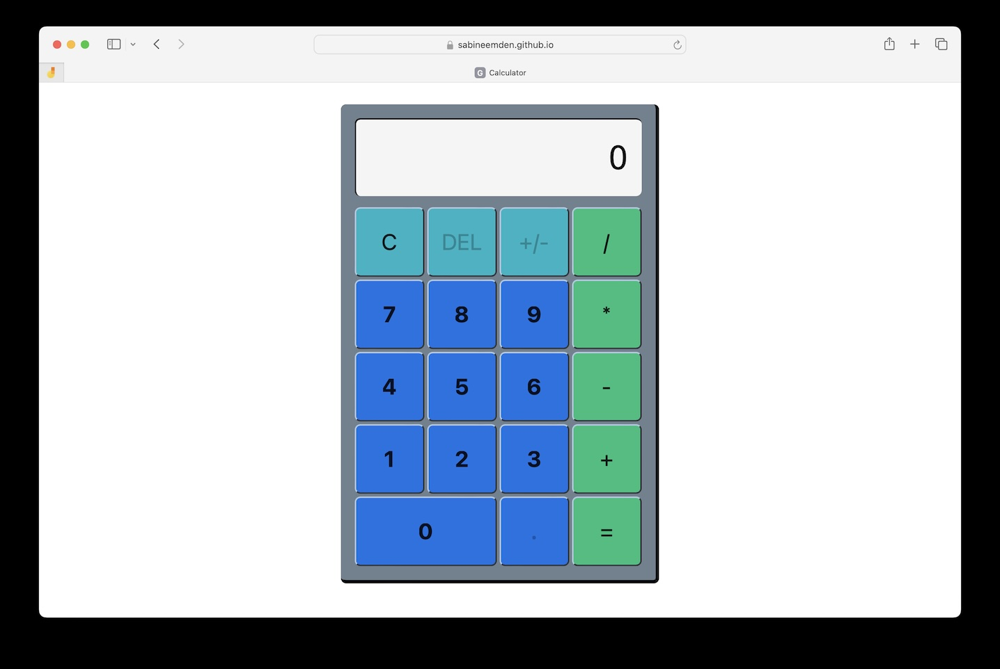

# The Odin Project - Calculator

This is a solution to [Project: Calculator](https://www.theodinproject.com/lessons/foundations-calculator) for The Odin Project. [The Odin Project](https://www.theodinproject.com/about) provides a free open source coding curriculum that can be taken entirely online.

Project: Calculator is the final project in the Foundations Course.

## Table of contents

- [Overview](#overview)
  - [Screenshot](#screenshot)
  - [Links](#links)
  - [Changelog](#changelog)
- [My process](#my-process)
  - [Built with](#built-with)
  - [What I learned](#what-i-learned)
  - [Continued development](#continued-development)
  - [Useful resources](#useful-resources)
- [Author](#author)
- [Acknowledgments](#acknowledgments)

## Overview

The calculator can perform addition, subtraction, multiplication, and division. It evaluates a single pair of numbers at a time, ignoring the order of precedence.

The user interface resembles a physical calculator. It has buttons for the ten digits, each of the four basic math operators, an "equals" button, and a "clear" button. The user clicks these buttons to enter data. A display shows the numbers the user has entered and the results of the mathematical operations.

The button for the decimal point, the backspace button to delete the digit that was last entered, and the button to toggle between positive and negative numbers are part of the extra credit and currently deactivated.

### Screenshot



### Links

- Solution URL: https://github.com/SabineEmden/calculator
- Live Site URL: https://sabineemden.github.io/calculator/

### Changelog

I plan to improve this project over time, implementing the features for extra credit and refactoring it as my coding skills develop.

#### Version 1.0.0 - 2024-07-05

Meets all requirements for the basic version of the project. Doesn't include any of the features for extra credit.

## My process

This was the most challenging coding project I've completed so far and the first where I needed to plan my project with pen on paper before I wrote the JavaScript code.

### Built with

- HTML Foundations
- CSS Foundations
- Flexbox
- JavaScript Basics
- Version control with git

### What I learned

One of the hardest parts of the project was identifying situations that fall outside normal procedures and ensuring the code handles these edge cases gracefully.

For example, the regular, expected scenario when the user clicks the "equals" button is:

- The number the user entered before clicking the "equals" button is stored as a string in the `input` variable. The `storeNumber()` function is called to convert the string into a number and store it in one of the two number variables that are used for the mathematical operation.
- The `operate()` function is called to perform the math operation and show the result in the display.

The code also handles the following edge cases:

- If the user did not enter a number right before clicking the "equals" button, then the `input` variable is an empty string. The `storeNumber()` function is not called.
- If the user did not enter any number or select an operator before clicking the "equals" button, then the first number variable `numA` and the `operator` variable are set to their initial values `null`. The `operate()` function is not called, and the `return` value ends the function execution.

```js
equalsKey.addEventListener("click", () => {
  if (input.length > 0) {
    storeNumber();
  }
  if (numA === null || operator === null) {
    return;
  } else {
    operate();
  }
});
```

### Continued development

This project concludes the [Foundations Course](https://www.theodinproject.com/paths/foundations/courses/foundations) in The Odin Project. I plan to continue on the [Full Stack JavaScript](https://www.theodinproject.com/paths/full-stack-javascript) learning path.

### Useful resources

- [An Interactive Guide to Flexbox](https://www.joshwcomeau.com/css/interactive-guide-to-flexbox/) by Josh Comeau - This is a great article that helped me understand how CSS Flexbox works. I'd recommend it to anyone still learning this layout mode.

## Author

Find me online:

- Mastodon - [@sabineemden](https://mastodon.online/@sabineemden)

## Acknowledgements

I used the Apple Calculator app on iOS 17.5 as a reference how the calculator should work and as inspiration for the user interface.

I used a template from a challenge on [Frontend Mentor](https://www.frontendmentor.io/) for this README file.
